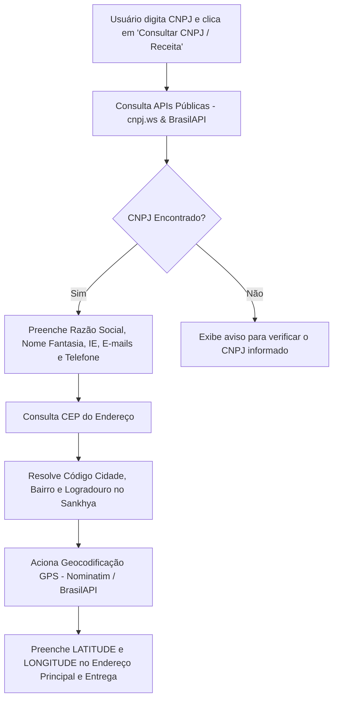

# Módulo de Cadastro de Clientes & Integração Sankhya ERP — Manual Completo de Documentação

> **Documento de Referência Técnica e de Continuidade**  
> **Data de Atualização**: 25/08/2026  
> **Projeto**: Financeiro Sankhya (Módulo Cadastro de Parceiros / Clientes)  
> **Tecnologias**: Next.js 16 (Turbopack), React Query (TanStack Query), TailwindCSS, TypeScript, NestJS, Sankhya OAuth Gateway (ServiceSP API / Oracle DB).

---

## 📋 Sumário

1. [Visão Geral e Arquitetura do Sistema](#1-visão-geral-e-arquitetura-do-sistema)
2. [Histórico e Funcionalidades Construídas](#2-histórico-e-funcionalidades-construídas)
3. [Mapeamento de Banco de Dados Oracle / Sankhya](#3-mapeamento-de-banco-de-dados-oracle--sankhya)
4. [Especificação dos Serviços Sankhya Chamados](#4-especificação-dos-serviços-sankhya-chamados)
5. [Módulo de Anexos & Documentos (TSIATA & BLOB Extraction)](#5-módulo-de-anexos--documentos-tsiata--blob-extraction)
6. [Gestão de Endereço Principal & Entrega (TGFCPL)](#6-gestão-de-endereço-principal--entrega-tgfcpl)
7. [Consulta de CNPJ, Geocodificação GPS e Auto-Preenchimento](#7-consulta-de-cnpj-geocodificação-gps-e-auto-preenchimento)
8. [Status da Aplicação e Verificação](#8-status-da-aplicação-e-verificação)

---

## 1. Visão Geral e Arquitetura do Sistema

O **Módulo de Cadastro de Clientes** gerencia a criação, consulta, alteração, vinculação de empresas/tabelas de preço e anexação de documentos para parceiros comerciais no ERP Sankhya.

```
┌─────────────────────────────────────────────────────────────────────────────┐
│                            FRONTEND (Next.js 16)                            │
│  - /clientes (Tabela, Filtros, Paginação)                                   │
│  - ClienteFormModal.tsx (Modal de 8 abas com React Query & Tailwind)        │
└──────────────────────────────────────┬──────────────────────────────────────┘
                                       │ HTTP / REST (JSON & Blob)
┌──────────────────────────────────────▼──────────────────────────────────────┐
│                             BACKEND (NestJS)                                │
│  - ClienteController (@Controller('api/clientes'))                          │
│  - ClienteUseCases (Regras de Negócio, Validações)                          │
│  - SankhyaClienteRepository (Implementação IClienteRepository)               │
└──────────────────────────────────────┬──────────────────────────────────────┘
                                       │ OAuth Bearer + JSON Services / SQL
┌──────────────────────────────────────▼──────────────────────────────────────┐
│                          SANKHYA ERP & ORACLE DB                            │
│  - Gateway OAuth / ServiceSP (DbExplorerSP, DatasetSP, Attach.view/remove)   │
│  - Tabelas: TGFPAR, TGFCPL, TSIATA, TGFPAEM, TSIREG, TGFTPP, TSIBCO          │
└─────────────────────────────────────────────────────────────────────────────┘
```

---

## 2. Histórico e Funcionalidades Construídas

### 2.1. Interface de Usuário & Modal Unificado (8 Abas)
- **Visual Moderno e Vibrante**: Desenvolvido com TailwindCSS, suporte a dark/light mode e micro-animações.
- **Navegação por Abas**:
  1. *Dados Gerais*: Razão Social, Nome Fantasia, CNPJ/CPF com card em destaque, Tipo Pessoa, Ativo, Bloqueio Comercial, Tipo Parceiro, Região, Banco Boleto (`AD_CODBCOBOL`).
  2. *Contato*: Telefone, E-mail principal, E-mail DANFE (`EMAILDANFE`), E-mail NFe (`EMAILNFE`), Notificação de entrega.
  3. *Endereço*: Sub-divisões unificadas para **Endereço Principal** e **Endereço de Entrega**, com CEP no topo, resolução de cidade/bairro/logradouro, geocodificação GPS manual e campo `AD_ENDCOMPLETO`.
  4. *Empresas / Grupo ICMS*: Tabela dinâmica vinculando o parceiro às empresas liberadas (`TGFPAEM`) e respectivas tabelas de preço / classificação ICMS.
  5. *Financeiro & Crédito*: Limite de Crédito, Limite Mensal, Prazo Pagamento, Título Vencidos Máximos, Tabela de Preço Padrão, Desc. Bonificação/Financeiro, Retenções de Impostos (ISS, INSS, PIS, COFINS, CSL).
  6. *Fiscal*: Inscrição Estadual, Inscrição Municipal, Enquadramento Simples Nacional, Regime Especial ISS, Perfil Econect.
  7. *Campos Customizados (`AD_`)*: Formulário para campos legados/específicos (`AD_CREDCLI`, `AD_LIMITEPAR`, `AD_LOCALCAD`, `AD_DTAPROVREP`).
  8. *Anexos & Documentos*: Upload, visualização inline, extração binária e download de documentos vinculados na `TSIATA`.

---

## 3. Mapeamento de Banco de Dados Oracle / Sankhya

| Tabela | Entidade | Descrição | Principais Campos Mapeados |
|---|---|---|---|
| **`TGFPAR`** | `Parceiro` | Cadastro principal do parceiro/cliente | `CODPARC`, `NOMEPARC`, `RAZAOSOCIAL`, `CGC_CPF`, `TIPPESSOA`, `SITUACAO`, `ATIVO`, `CODTIPPARC`, `CODREG`, `CODBCO`, `LATITUDE`, `LONGITUDE`, `DTCAD`, `DTALTER`, `BLOQUEAR`, `MOTBLOQ`, `EMAILDANFE`, `EMAILNFE`, `AD_CODBCOBOL`, `AD_ENDCOMPLETO` |
| **`TGFCPL`** | `ComplementoParc` | Complemento e endereço de entrega | `CODPARC`, `CEP`, `CODEND`, `NUMEND`, `COMPLEMENTO`, `CODBAI`, `CODCID`, `LATITUDEENTREGA`, `LONGITUDEENTREGA`, `DTALTER` |
| **`TSIATA`** | `AnexoSistema` | Tabela nativa de anexos com conteúdo BLOB | `CODATA` (`CODPARC`), `SEQUENCIA`, `TIPO` (`'P'`), `DESCRICAO`, `ARQUIVO`, `CONTEUDO` (`BLOB`), `TIPOCONTEUDO`, `DTALTER` |
| **`TGFPAEM`**| `ParceiroEmpresGrupoIcms` | Configurações de empresas/grupo ICMS | `CODPARC`, `CODEMP`, `CODTAB`, `CLASSIFICMS` |
| **`TGFTPP`** | `TipoParceiro` | Tipos cadastrados de parceiro | `CODTIPPARC`, `DESCRTIPPARC` |
| **`TSIREG`** | `Regiao` | Regiões comerciais | `CODREG`, `NOMEREG` |
| **`TSIBCO`** | `Banco` | Cadastro de bancos | `CODBCO`, `NOMEBCO` |

---

## 4. Especificação dos Serviços Sankhya Chamados

### 4.1. Consulta SQL Dinâmica (`DbExplorerSP.executeQuery`)
Utilizado para leituras de tabelas, joins e extração de BLOBs binários do Oracle:
```json
{
  "serviceName": "DbExplorerSP.executeQuery",
  "requestBody": {
    "sql": "SELECT CODATA, SEQUENCIA, ARQUIVO, DBMS_LOB.GETLENGTH(CONTEUDO) AS TAMANHO FROM TSIATA WHERE TIPO='P' AND CODATA=6614"
  }
}
```

### 4.2. Persistência de Dados (`DatasetSP.saveRecord`)
Utilizado para inserção e atualização de registros nas entidades `Parceiro` (`TGFPAR`), `ComplementoParc` (`TGFCPL`) e `ParceiroEmpresGrupoIcms` (`TGFPAEM`):
```json
{
  "serviceName": "DatasetSP.saveRecord",
  "requestBody": {
    "dataSetID": "001",
    "entityName": "ComplementoParc",
    "standAlone": false,
    "records": [{
      "values": {
        "CODPARC": "6614",
        "CEP": "74000000",
        "CODEND": "10",
        "NUMEND": "100",
        "DTALTER": "25/08/2026"
      }
    }]
  }
}
```

### 4.3. Remoção de Anexo Nativa (`Attach.remove`)
Remove o registro do anexo da entidade `TSIATA`:
```json
{
  "serviceName": "Attach.remove",
  "requestBody": {
    "anexo": {
      "codata": 6614,
      "sequencia": 0,
      "tipo": "P",
      "descricao": "Documento"
    }
  }
}
```

---

## 5. Módulo de Anexos & Documentos (TSIATA & BLOB Extraction)

### Arquitetura de Leitura Binária Direct-to-Oracle
Devido a restrições de ambiente do Sandbox (onde diretórios de arquivos físicos no disco do gateway não estão disponíveis), o sistema utiliza a extração de dados binários em tempo real diretamente da coluna `CONTEUDO` (`BLOB`) da tabela Oracle `TSIATA`:

1. **Chave Única do Anexo**: `CODATA = CODPARC` + `SEQUENCIA` (onde `TIPO = 'P'`).
2. **Leitura em Chunks Paralelos**:
   - Para arquivos de qualquer tamanho (ex: imagens PNG de 400KB ou PDFs), o backend consulta o tamanho total via `DBMS_LOB.GETLENGTH(CONTEUDO)`.
   - Divide a leitura em blocos de 2000 bytes utilizando `RAWTOHEX(DBMS_LOB.SUBSTR(CONTEUDO, 2000, POS))`.
   - Executa as requisições em paralelo (`Promise.all` em lotes de 30).
   - Reconstitui o buffer final (`Buffer.concat`) e identifica o MIME Type pelos magic bytes (`89504E47`=PNG, `FFD8FF`=JPEG, `25504446`=PDF, etc.).
3. **Cache Local de Desempenho**: Salva uma cópia dos anexos baixados em `uploads/anexos/`, acelerando visualizações subsequentes.

---

## 6. Gestão de Endereço Principal & Entrega (TGFCPL)

### Regra de Persistência Dinâmica
- **Endereço Principal**: Salvo diretamente na tabela `TGFPAR` (`CODEND`, `NUMEND`, `COMPLEMENTO`, `CODBAI`, `CODCID`, `CEP`, `LATITUDE`, `LONGITUDE`).
- **Endereço de Entrega**: Salvo na tabela filha `TGFCPL`.
  - Ao atualizar um cliente, o sistema verifica se o registro `TGFCPL` já existe no banco.
  - Se existir, executa `UPDATE` via `DatasetSP.saveRecord`.
  - Se não existir e houver dados de entrega informados, executa `INSERT` via `DatasetSP.saveRecord` incluindo automaticamente a data da alteração (`DTALTER`).

---

## 7. Consulta de CNPJ, Geocodificação GPS e Auto-Preenchimento



---

## 8. Status da Aplicação e Verificação

### Testes e Compilação
- **Backend NestJS**: `npx tsc --noEmit` ➔ **0 erros**.
- **Frontend Next.js**: `npx tsc --noEmit` ➔ **0 erros**.
- **Servidores em Execução**:
  - Backend: `http://localhost:3001` (NestJS dev server)
  - Frontend: `http://localhost:3000` (Next.js 16 dev server)

---
*Manual atualizado mantendo a integridade de todas as especificações técnicas da solução.*
