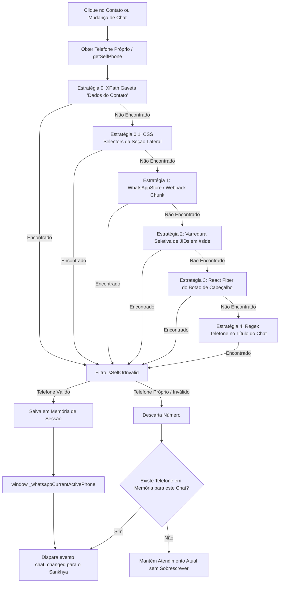

# 📱 Documentação Técnica: Extração de Telefone no WhatsApp Web, Blindagem & Fila de Cobrança

---

## 🎯 1. Visão Geral e Problemas Resolvidos

Esta documentação detalha a arquitetura de sincronização em tempo real entre o **WhatsApp Web**, a **Extensão Chrome (Manifest V3)** e o **Painel Financeiro Sankhya (Next.js / NestJS)**.

### 🛑 Problemas Históricos Identificados:
1. **Contatos Salvos na Agenda**: O WhatsApp Web exibe apenas o nome no cabeçalho (`#main header`), sem expor o telefone diretamente na árvore principal.
2. **Auto-Detecção do Usuário Logado ("Antony Barbosa")**: Mensagens enviadas contêm o JID do próprio remetente (`data-id="true_55819...@c.us"`). Varreduras genéricas no DOM capturavam o número do atendente e consultavam seus dados no Sankhya.
3. **Perda de Referência ao Fechar Gaveta ("Dados do Contato")**: Ao fechar o painel lateral do contato (`#app section`), o elemento contendo o telefone era desmontado do DOM, fazendo a extensão disparar eventos sem telefone e o painel reverter para itens antigos da fila por correspondência de nome.
4. **Perda de Foco / Cursor no Input de Busca da Fila**: O cursor saía do campo de busca (`fila-busca-cliente-input`) enquanto o usuário digitava devido a re-renderizações cíclicas disparadas pelo polling de status da extensão.

---

## 🏗️ 2. Arquitetura da Cascata de Extração (`extension/src/dom.js`)

A função `WhatsAppDOM.getActiveChatInfo()` executa a seguinte ordem de resolução resiliente:



---

## 🔍 3. Detalhamento Técnico das Camadas

### 🔹 1. Blindagem do Usuário Próprio (`getSelfPhone` e `isSelfOrInvalid`)
Para impedir que o atendente consulte a si mesmo no Sankhya:
- Lê o JID da sessão ativa em `localStorage.getItem("last-wid-md")`, `last-wid`, `me` e `me-user`.
- Inspeciona o avatar do usuário logado em `#side header img[src*='u=']`.
- A função `isSelfOrInvalid(phone)` compara os últimos 8 dígitos do número encontrado com o número próprio e com números inválidos/curtos.
- A varredura de JIDs foi **estritamente restrita** a `#side [aria-selected='true']` e `#main header div[role='button']`, eliminando varreduras em `#main *` (que capturavam mensagens enviadas).

### 🔹 2. Memória e Retenção Ativa de Contato (`window._whatsappCurrentActivePhone`)
Ao abrir os "Dados do Contato", o número é capturado via XPath e persistido:
```javascript
window._whatsappCurrentActivePhone = phone;
window._whatsappKnownChatPhones[chatTitle] = phone;
```
Quando o usuário fecha a gaveta de dados do contato:
- O elemento do DOM é destruído.
- A extensão verifica se o título do chat ativo ainda é o mesmo e reutiliza o telefone retido na memória.
- **Resultado**: O cliente permanece carregado na aba de atendimento do Sankhya sem recarregar nem buscar dados vazios.

### 🔹 3. Desacoplamento da Fila de Cobrança & Gestão de Estado (`SankhyaCustomerContextPanel.tsx`)
- **Remoção do `matchNome`**: O sistema não tenta mais adivinhar parceiros na fila por aproximação de nome quando o WhatsApp não fornece número.
- **Regra de Atualização da Aba Atendimento**:
  1. A aba "Atendimento" **SÓ** é atualizada se:
     - O operador clicar manualmente em um card da lista/fila de cobrança; **OU**
     - O operador abrir um contato com telefone válido ($\ge 8$ dígitos) no WhatsApp Web.
  2. Nenhuma ação de fechar gavetas, recarregar tela ou navegar entre abas limpa o cliente atualmente carregado.
- **Comportamento em Buscas sem Correspondência ("Não Localizado")**:
  - Quando um novo contato/telefone é consultado e **não possui cadastro** no Sankhya (`cliente: null` retornado da API), o estado do cliente anterior é devidamente resetado (`setCliente(null)`, `titulos: []`), exibindo o alerta visual informativo de *"Cliente não localizado no Sankhya"* com o número pesquisado, diagnóstico SQL e atalho para retornar à fila.

### 🔹 4. Estabilização do Foco no Campo de Busca (`WhatsAppEmbeddedTab.tsx`)
- **Causa Raiz**: O polling de heartbeat da extensão rodava a cada 1000ms chamando `setExtensionDetected(true)` incondicionalmente, forçando re-renderizações que recriavam o nó `<input>` no DOM e cancelavam o foco.
- **Correção**:
  - Polling ajustado com verificação funcional `setExtensionDetected((prev) => (prev ? prev : true))`.
  - Intervalo reduzido para 3000ms e logs repetitivos silenciados.
  - O campo de busca da fila recebeu `pointer-events-none` no ícone de lupa e remoção de listeners conflitantes de `onClick`/`onFocus`.

---

## 🛡️ 4. Regras de Validação no Backend e Frontend

| Camada | Arquivo | Regra | Ação em Caso de Falha |
|---|---|---|---|
| **Extensão** | `extension/src/dom.js` | `isSelfOrInvalid(phone)` + `cleanPhoneNumber()` | Ignora o número próprio e retorna `null` |
| **Bridge** | `frontend/lib/whatsappBridge.ts` | `isPayloadDifferent()` | Descarta eventos com payload idêntico |
| **Frontend** | `SankhyaCustomerContextPanel.tsx` | `telefone.replace(/\D/g, '').length >= 8` | Não dispara requisição de busca |
| **Backend** | `whatsapp.controller.ts` | `telefoneLimpo.length >= 8` | Retorna erro 400 (`Telefone inválido`) |

---

## 🔧 5. Guia de Manutenção e Atualização de XPaths

Caso o WhatsApp Web altere as classes ou estrutura da gaveta "Dados do contato":

### 📍 Passo a Passo para Inspecionar o Novo XPath:
1. Abra o WhatsApp Web no navegador Google Chrome e tecle `F12` (DevTools).
2. Clique no cabeçalho da conversa para abrir a gaveta lateral ("Dados do contato").
3. Use a ferramenta de seleção (`Ctrl + Shift + C`) e clique sobre o número de telefone exibido na lateral.
4. No painel **Elements**, clique com o botão direito sobre a tag `<span>` do telefone $\rightarrow$ **Copy** $\rightarrow$ **Copy XPath** e **Copy full XPath**.

### ✏️ Arquivos a Atualizar:
1. **`extension/src/dom.js`**:
   Adicione o novo XPath no início do array `xpaths`:
   ```javascript
   const xpaths = [
     'SEU_NOVO_XPATH_AQUI',
     '//*[@id="app"]/div/div/div[3]/div/div[6]/span/div/span/div/div/div/div/section/div[1]/div[2]/div[2]/span/div/span',
     '//*[@id="app"]//section/div[1]/div[2]/div[2]/span/div/span',
   ];
   ```

2. **Recarregar a Extensão**:
   - Abra `chrome://extensions/` no Chrome.
   - Localize a extensão **Financeiro Sankhya - Extrator de Telefone** e clique no ícone **Recarregar (🔄)**.
   - Pressione `F5` na aba do WhatsApp Web e na aba do sistema financeiro.
