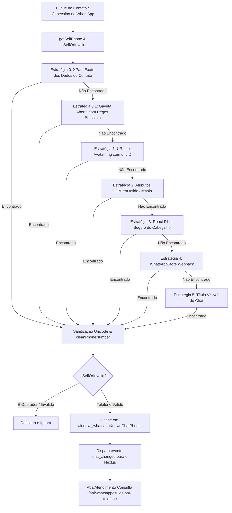

# 📱 Documentação Técnica: Extração de Telefone no WhatsApp Web, Abertura Direta & Integração Sankhya

---

## 🎯 1. Visão Geral e Arquitetura

Esta documentação detalha a arquitetura de sincronização em tempo real entre o **WhatsApp Web**, a **Extensão Chrome (Manifest V3)** e o **Painel Financeiro Sankhya (Next.js / NestJS)**.

### 🛑 Principais Desafios Resolvidos:
1. **Abertura Direta de Conversa via Link SPA**:
   - Ao clicar em um card da **Fila de Cobrança**, o sistema agora abre a conversa diretamente pelo número utilizando o deep-link SPA interno do WhatsApp (`https://web.whatsapp.com/send?phone=...`), sem depender de digitação ou busca na barra de pesquisa.
2. **Extração de Telefone com XPath Preciso**:
   - Integração da XPath prioritária de detalhes do contato:
     `//*[@id="app"]/div/div/div[3]/div/div[6]/span/div/span/div/div/div/div/section/div[1]/div[2]/div[2]/span/div/span`
3. **Tratamento de Caracteres Unicode Invisíveis**:
   - O WhatsApp Web envolve os números com marcadores de direção de texto Unicode (`\u202A`, `\u202C`, `\u200E`, `\u200F`). O parser agora faz a extração sanitizada desses caracteres antes da validação.
4. **Eliminação de Polling Automático de Fundo**:
   - O temporizador de segundo plano que varria o DOM continuamente foi removido. A extração e consulta agora ocorrem estritamente sob eventos de **clique deliberado** do operador (abertura de contato ou seleção na fila).
5. **Blindagem Contra Auto-Detecção do Operador**:
   - O número de telefone do operador (`8198705664` / Antony Barbosa) é filtrado estritamente por `isSelfOrInvalid()`, nunca gerando consultas acidentais.
6. **Transição Automática e Estável de Abas**:
   - Clicar em um contato no WhatsApp Web muda automaticamente para a aba **Atendimento** e carrega os títulos do cliente no Sankhya.
   - Fechar a gaveta do WhatsApp Web não recarrega a tela nem desmonta os dados do cliente carregado.

---

## 🏗️ 2. Fluxo da Cascata de Extração (`extension/src/dom.js`)



---

## 🔍 3. Detalhamento dos Componentes

### 🔹 1. Abertura Direta de Conversa (`extension/src/controller.js`)
Quando o operador clica no botão "Cobrar" de um card:
```javascript
// Estratégia 1: Link SPA Direto (rápido e sem digitar na barra de pesquisa)
const digits = String(targetPhone).replace(/\D/g, "");
const fullPhone = digits.length <= 11 && !digits.startsWith("55") ? "55" + digits : digits;
const link = document.getElementById("sankhya-skill-link") || createSkillLink();
link.href = `https://web.whatsapp.com/send?phone=${fullPhone}`;
link.click();
```

### 🔹 2. Extração por XPath e Gaveta (`extension/src/dom.js`)
Avalia os nós da gaveta lateral priorizando o caminho exato:
```javascript
const exactXPaths = [
  '//*[@id="app"]/div/div/div[3]/div/div[6]/span/div/span/div/div/div/div/section/div[1]/div[2]/div[2]/span/div/span',
  '//*[@id="app"]//section/div[1]/div[2]/div[2]/span/div/span',
  '//section/div[1]/div[2]/div[2]/span/div/span'
];
```

### 🔹 3. Disparo por Clique Sem Falsos Positivos (`extension/content.js`)
Ao detectar o clique no contato, o evento é acionado nos tempos de renderização da interface (`150ms`, `500ms`, `1000ms`, `1800ms`):
- Cliques no botão de fechar a gaveta (`X`, `Fechar`, `btn-closer`) são silenciados para impedir reloads fantasmas.
- O polling contínuo no `setInterval` foi desativado, evitando que strings aleatórias da tela sejam tratadas como telefones.

### 🔹 4. Consulta e Retenção no Painel (`SankhyaCustomerContextPanel.tsx`)
- Ao receber o novo número, o painel alterna para **Atendimento** e busca os títulos na API.
- Se o cliente for localizado: exibe o cabeçalho financeiro, títulos em aberto, botões de ação (Enviar Mensagem, PIX, DANFE, Boleto) e simulador de renegociação.
- Se o cliente não for localizado: exibe o card informativo com o número buscado, diagnóstico e botão rápido para voltar à fila.

---

## 🛠️ 4. Guia de Manutenção e Atualização de XPaths

Se o WhatsApp Web alterar a estrutura dos nós em versões futuras:

1. Abra o WhatsApp Web no navegador e tecle `F12` (DevTools).
2. Clique no cabeçalho da conversa para abrir a gaveta lateral ("Dados do contato").
3. Use a ferramenta de seleção (`Ctrl + Shift + C`) e clique sobre o número de telefone exibido na lateral.
4. Clique com o botão direito no elemento $\rightarrow$ **Copy** $\rightarrow$ **Copy XPath**.
5. No arquivo `extension/src/dom.js`, adicione o novo XPath no topo do array `exactXPaths`.
6. Recarregue a extensão em `chrome://extensions/` (ícone 🔄) e dê `F5` no sistema.
   - Localize a extensão **Financeiro Sankhya - Extrator de Telefone** e clique no ícone **Recarregar (🔄)**.
   - Pressione `F5` na aba do WhatsApp Web e na aba do sistema financeiro.
