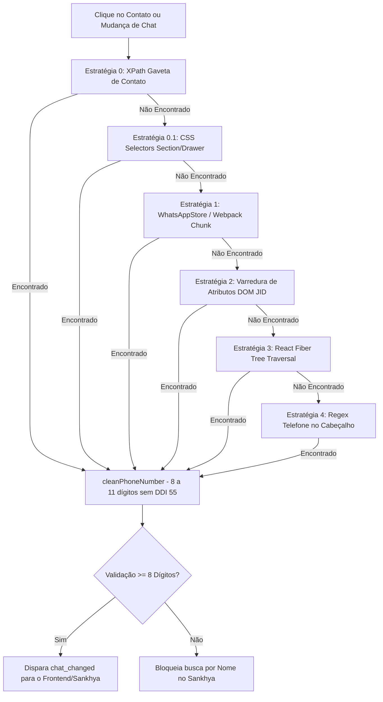

# 📱 Documentação Técnica: Extração de Telefone no WhatsApp Web & Guia de Manutenção

## 🎯 1. Contexto e Problema Resolvido

No WhatsApp Web oficial, quando uma conversa é com um **contato salvo na agenda** (exemplo: *"Naelson Pessoa"*):
- O cabeçalho da conversa (`#main header`) renderiza **apenas o nome do contato** e não o número de telefone.
- Enviar o nome do contato para o Sankhya (`/api/whatsapp/titulos-por-telefone?telefone=Naelson Pessoa`) causava falha ou busca indevida, pois o Sankhya pesquisa na base financeira por números de telefone (`TGFPAR.TELEFONE`, `TGFCTT.TELEFONE`, `TGFCTT.CELULAR`).

Para resolver isso de forma resiliente e compatível com as atualizações do WhatsApp Web, foi implementada uma **cascata multicamada de 5 estratégias de extração** no módulo `extension/src/dom.js`.

---

## 🏗️ 2. Arquitetura da Cascata de Extração (`extension/src/dom.js`)

A função `WhatsAppDOM.getActiveChatInfo()` executa a seguinte ordem de resolução:



### 📋 Detalhamento das Estratégias:

#### 🔹 Estratégia 0: XPath Exato e Relativo da Gaveta de Dados do Contato
Lê o número exibido no painel lateral de informações do contato ("Dados do contato"):
- **XPath Exato**: `//*[@id="app"]/div/div/div[3]/div/div[6]/span/div/span/div/div/div/div/section/div[1]/div[2]/div[2]/span/div/span`
- **XPath Semântico**: `//*[@id="app"]//section/div[1]/div[2]/div[2]/span/div/span`
- **XPath Genérico**: `//section//div[2]/div[2]/span/div/span`
- **XPath por Conteúdo**: `//section//span[contains(text(), "+55")]`

#### 🔹 Estratégia 0.1: CSS Selectors na Seção Lateral
- `#app section span, section div[role='region'] span, div[tabindex='-1'] span` com regex de formato brasileiro `^\+?55\s?\(?\d{2}\)?\s?\d{4,5}[-\s]?\d{4}$`.

#### 🔹 Estratégia 1: Injeção nos Webpack Chunks do WhatsApp Web (`WhatsAppStore`)
Injeta no carregamento do Webpack (`window.webpackChunkwhatsapp_web_client`) para capturar `ChatCollection`, `ContactCollection` e `getActiveChat()`, extraindo diretamente o `jid.user` (ex: `558192723826@c.us`).

#### 🔹 Estratégia 2: Varredura de Atributos DOM
Varre atributos HTML (`data-id`, `src`, `href`, `title`) em `#main *` e `#side [aria-selected='true']` procurando padrões de JID (`(\d{10,13})@c.us`, `u=(\d{10,13})`).

#### 🔹 Estratégia 3: Traversal Recursivo da Árvore React Fiber
Percorre a instância React Fiber dos nós DOM (`__reactFiber$*` / `__reactProps$*`) subindo e descendo por `return`, `child`, `sibling`, `memoizedProps` e `memoizedState` inspecionando objetos internos do WhatsApp.

#### 🔹 Estratégia 4: Regex de Cabeçalho
Utilizado para contatos não salvos (onde o cabeçalho já exibe o próprio número formatado).

---

## 🛡️ 3. Regras de Blindagem e Segurança no Sankhya

Para garantir que nomes de contatos nunca vazem ou consultem dados financeiros incorretos:

1. **Frontend (`SankhyaCustomerContextPanel.tsx`)**:
   - Só dispara a busca para `/api/whatsapp/titulos-por-telefone` se `telefone` possuir **8 ou mais dígitos numéricos**.
   - Se houver apenas nome (sem telefone extraído), tenta localizar o parceiro na **Fila de Cobrança do Dia** local antes de qualquer requisição.
2. **Backend (`whatsapp.controller.ts`)**:
   - Rejeita requisições com menos de 8 dígitos (`Telefone inválido (< 8 dígitos)`).
   - Busca na base Oracle pelas tabelas `TGFPAR` e `TGFCTT` comparando os últimos 8 dígitos do telefone/celular.

---

## 🔧 4. Guia de Manutenção Futura (Em caso de atualização do WhatsApp)

Se o WhatsApp Web atualizar a estrutura de classes ou árvore DOM e o número deixar de ser extraído:

### 📍 Como Inspecionar o Novo XPath:
1. Abra o WhatsApp Web no Chrome e pressione `F12` (DevTools).
2. Clique no cabeçalho do contato para abrir a gaveta lateral ("Dados do contato").
3. Use a ferramenta de seleção de elementos (`Ctrl + Shift + C`) e clique sobre o número de telefone no painel lateral.
4. No DevTools Elements, clique com o botão direito no elemento `<span>` do número > **Copy** > **Copy XPath** ou **Copy full XPath**.

### ✏️ Arquivos a Atualizar:

1. **`extension/src/dom.js` (Linhas ~280-305)**:
   - Adicione o novo XPath no array `xpaths`:
   ```javascript
   const xpaths = [
     'SEU_NOVO_XPATH_AQUI',
     '//*[@id="app"]/div/div/div[3]/div/div[6]/span/div/span/div/div/div/div/section/div[1]/div[2]/div[2]/span/div/span',
     ...
   ];
   ```

2. **`extension/src/selectors.js`**:
   - Verifique se os seletores de cabeçalho (`HEADER_TITLE`, `CHAT_PANEL`) mudaram de classe.

3. **Recarregar a Extensão**:
   - Acesse `chrome://extensions/` e clique no ícone **Recarregar (🔄)** da extensão.
   - Pressione `F5` na aba do sistema e na aba do WhatsApp.
